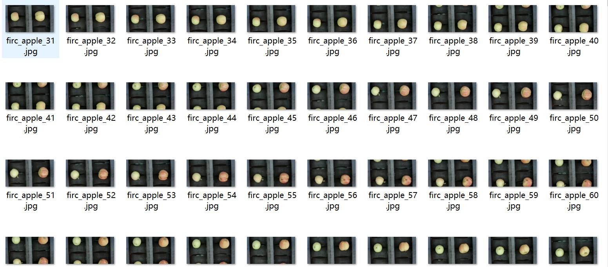
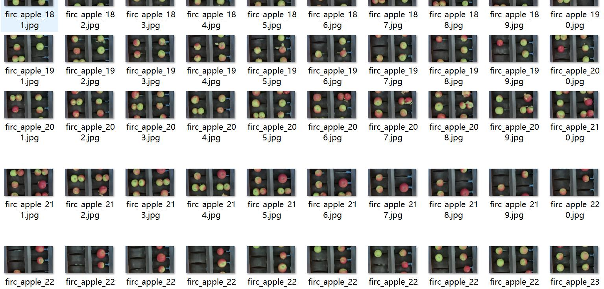
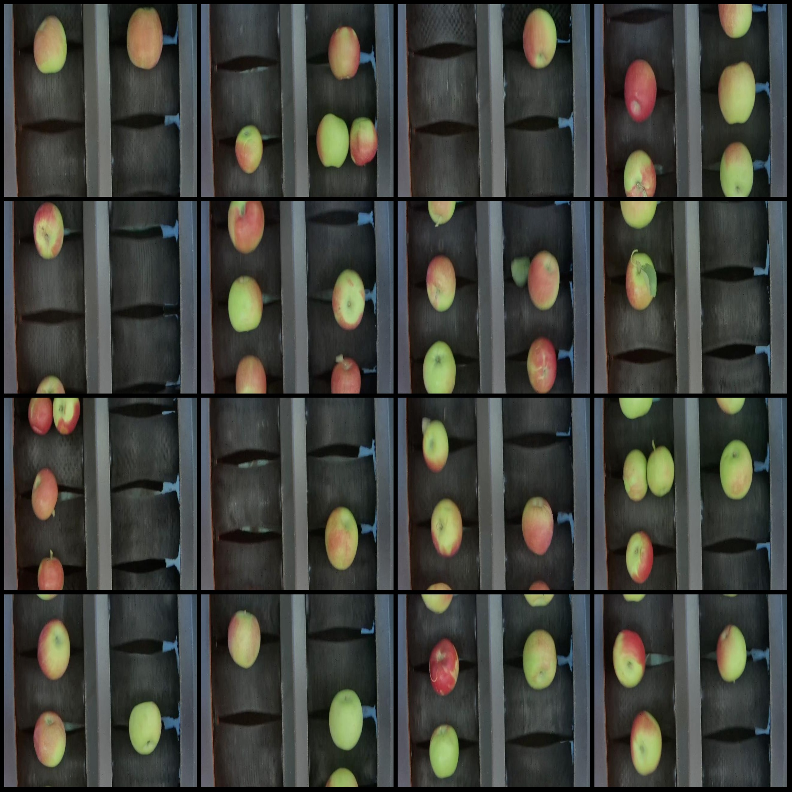
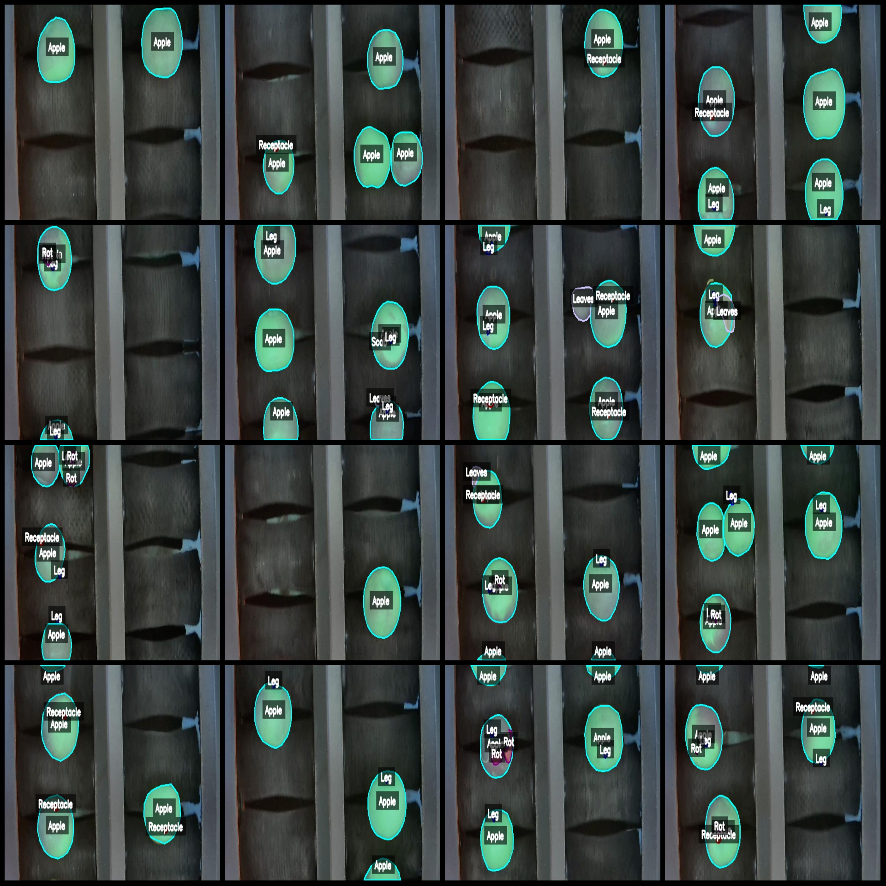
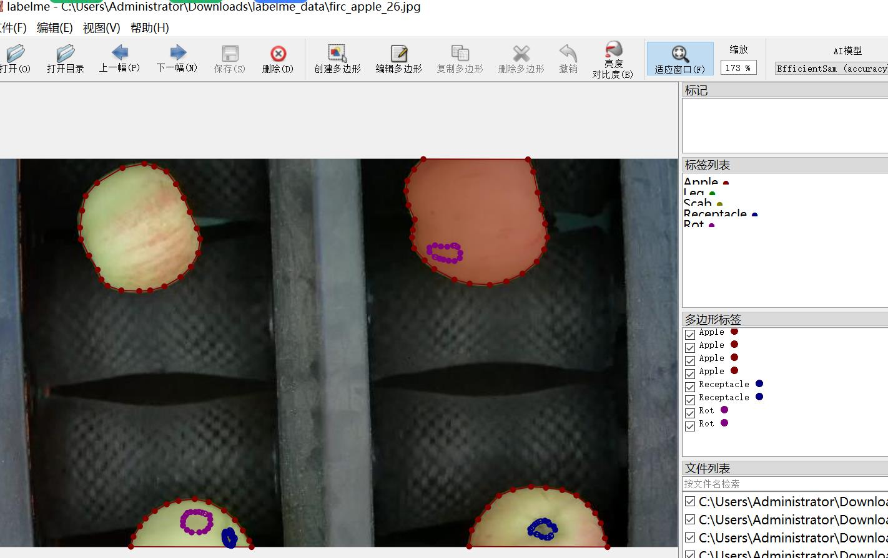

# Apple Quality Inspection Data Set - LabelMe Format, 5842 Images in 8 Categories

Dataset format: LabelMe format (excluding mask files, only containing jpg images and corresponding json files).
Number of images (number of jpg files): 5842
Number of annotations (json file count): 5842
Number of annotated categories: 8
Annotated category names: ["Apple", "Leg", "Receptacle", "Leaves", "Scab", "Rot", "Net", "Mehan"]
Number of boxes per category:
- Apple (apple fruit) count = 21108
- Leg (stem/rhizome) count = 6945
- Receptacle (calyx) count = 6803
- Leaves (leaf) count = 2994
- Scab (black spot) count = 767
- Rot (rottenness) count = 1790
- Net (netting/net bag) count = 36
- Mehan (mildew/like a disease) count = 87
Total box count: 40530
Annotation tool used: labelme=5.5.0
Image resolution: 640x360
Annotation rules: Polygons are drawn around the categories.
Important note: This dataset can be edited with LabelMe, but the json dataset needs to be converted into either mask or yolo or coco format for semantic segmentation or instance segmentation.
Special declaration: This dataset does not guarantee the accuracy of the trained model or weight files.
Image preview:
Annotation example:
Original images (randomly selected 16):
Annotation drawing results:

## Images

Here is a pay link on Stripe ( https://buy.stripe.com/3cs8yP7sY87d0vu9AB ). Please contact me lonlonago@foxmail.com after funding $89, and I will send you a complete data files , thank you!

